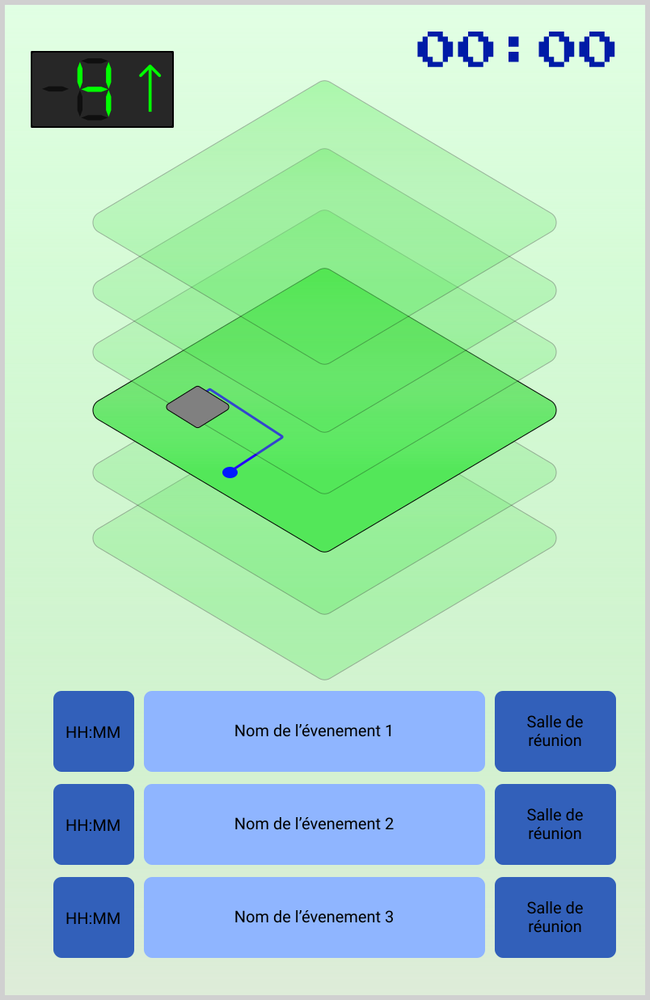

# Maquette d'afficheur de chemins dynamique
Le but de cet afficheur est de faciliter les déplassements des administrés au sein de l'autel de ville.
Il devra donc être possible de visualiser le chemin à emprunter pour se rendre dans différentes salles du bâtiment, ainsi que d'associer une salle à des réunions qui s'y déroulent, permettant ainsi aux administrés qui ne connaîtrait pas le nom de la salle de tout de même parvenir à se rendre à la réunion.

## Esquisse visuelle
Dans l'optique de rester le plus clair possible, il a été choisi de réaliser un plan étage par étage du bâtiment afin de pouvoir par la suite animer le chemin à prendre dans l'étage pour se rendre à l'étage suivant sur le chemin ou directement dans la salle recherchée.
En dessous de ce plan se trouvera une liste des réunions en cours ou sur le point de commencer. 
Seront indiqués dans cette liste: 
* L'heure à laquelle doit commencer la réunion
* Son intitulé
* La salle dans laquelle ele doit avoir lieu

On pourrait envisager de réaliser une interface physique afin de permettre aux usagers de parcourir la liste des réunions et faire afficher le chemin à emprunter.
Dans ce cas l'afficheur jouerai une animation _"idle"_ qui reste facultative.

