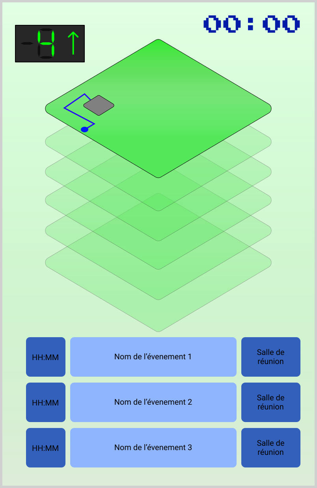

# Maquette d'afficheur de chemins dynamique
Le but de cet afficheur est de faciliter les déplassements des administrés au sein de l'autel de ville.
Il devra donc être possible de visualiser le chemin à emprunter pour se rendre dans différentes salles du bâtiment, ainsi que d'associer une salle à des réunions qui s'y déroulent, permettant ainsi aux administrés qui ne connaîtrait pas le nom de la salle de tout de même parvenir à se rendre à la réunion.

## Cahier des charges
L'objectif principale de l'afficheur est d'aider aux déplacements des administrés dans l'autel de ville de la manière la plus intuitive possible.
Pour réaliser cette fonction, l'afficheur devra :
* Permettre de guider les administrés vers les salles les plus courament visités.
* Afficher en temps réel les réunions.
* Permettre de choisir la réunion ou la salle vers laquelle l'usager doit se rendre.
* Afficher le chemin de la manière la plus intuitive et claire possible.
* Etre utilisable par tout types de personnes, peu importe leurs connaissances ou leur condition physique.
* La solution devra églement être réalisable sur la durée du stage et ne doit pas nécessiter de travail ultérieur pour assurer son fonctionnement.

## Esquisse visuelle
Dans l'optique de rester le plus clair possible, il a été choisi de réaliser un plan étage par étage du bâtiment afin de pouvoir par la suite animer le chemin à prendre dans l'étage pour se rendre à l'étage suivant sur le chemin ou directement dans la salle recherchée.
En dessous de ce plan se trouvera une liste des réunions en cours ou sur le point de commencer. 
Seront indiqués dans cette liste: 
* L'heure à laquelle doit commencer la réunion
* Son intitulé
* La salle dans laquelle ele doit avoir lieu

On pourrait envisager de réaliser une interface physique afin de permettre aux usagers de parcourir la liste des réunions et faire afficher le chemin à emprunter.
Dans ce cas l'afficheur jouerai une animation _"idle"_ lorsqu'aucune réunion n'a été selectionnée.

Ci-dessous un exemple d'un tel affichage (sans animations):

Début du chemin:

Fin du chemin:

Il est évident que les choix graphiques sont ici temporaires et ne reflètent pas l'aspect graphique final de la solution, ces maquettes ne servent qu'à illustrer le principe de la solution présentée.
Il est notament prévu d'avoir un plan approximatif de chaque étage pour aider les administrés à mieux se repérer sur le plan. Et pourquoi pas également ajouter les emplacements des sorties ou des sanitaires à la liste des chemins possibles.

## Architecture programme
Il est proposé de travailler avec un affichage de type web via CSS/JS ou PHP et de réaliser les animations par l'intermédiaire de graphiques SVG dont les éléments pourront être utilisés et modifiés par du code CSS. Cela permettrai de génerer les animations automatiquement, nous evitant de réaliser à la main les animations pour se rendre dans chaque salle du bâtiment.
Pour ce qui est de la génération à proprement parler de ces chemins, il serait possible de représenter le bâtiment par une série de points par lesquels pourraient passer les administrés, et alors chaque chemin possible de l'afficheur à une salle pourrait être représenté par une liste ordonnée de ces points qui correspondraient à des coordonnées dans le SVG du plan. On pourra alors créer un vecteur ligne entre chacun des points à parcourir et ainsi animer ce chemin automatiquement.

Des framework comme ReacJS semblent bien adaptés pour la réalisation de cette partie.

Pour ce qui est de la gestion des réunions, toutes les informations étant déjà disponibles dans une base de donnée MySQL, il suffira au programme de Query cette base afin de récuperer les données nécessaires.

## Architecture matérielle potentielle
Pour permettre aux usagers de sélectionner la réunion sur laquelle ils veulent des informations, il sera nécessaire de mettre en place une interface physique, qu'elle soit sous la forme d'un écran tactille ou d'un boitier avec deux boutons pour monter et descendre dans la liste.

Au vue de la taille de l'écran considéré, le choix de le rendre tactille semble à la fois cher et peu fiable. Il est donc proposé de réaliser une interface avec deux boutons qui pourront être reliés directement à la raspberry pi qui s'occuperait de ce module.
Ce module de commande aurait alors simplement besoin d'une alimentation électrique et d'une connection au réseau de la mairie pour acceder à la base de donnée.